# Flutter WhatsAppCloneEvolvedVersion

Building a WhatsApp Clone in Flutter.

### Show some :heart: and star the repo to support the project

### Screenshots before evolution

 

### Screenshots AFTER evolution is done on it

 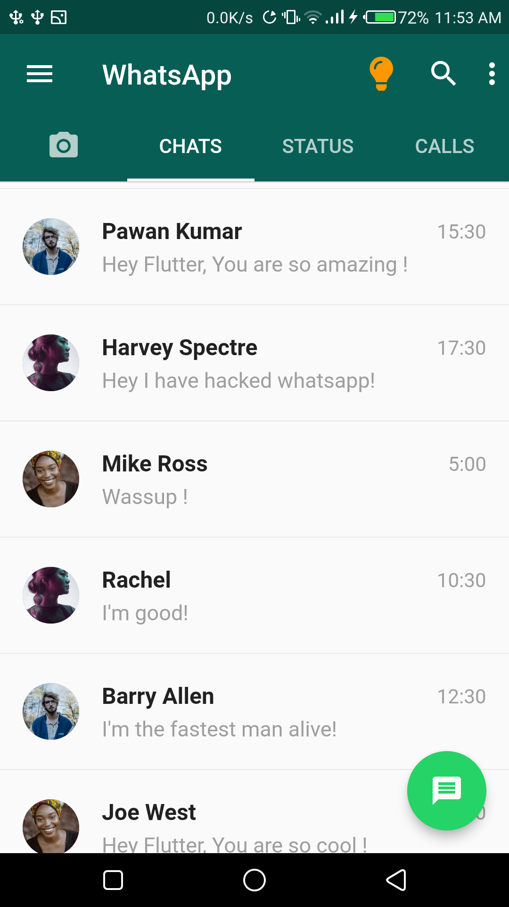
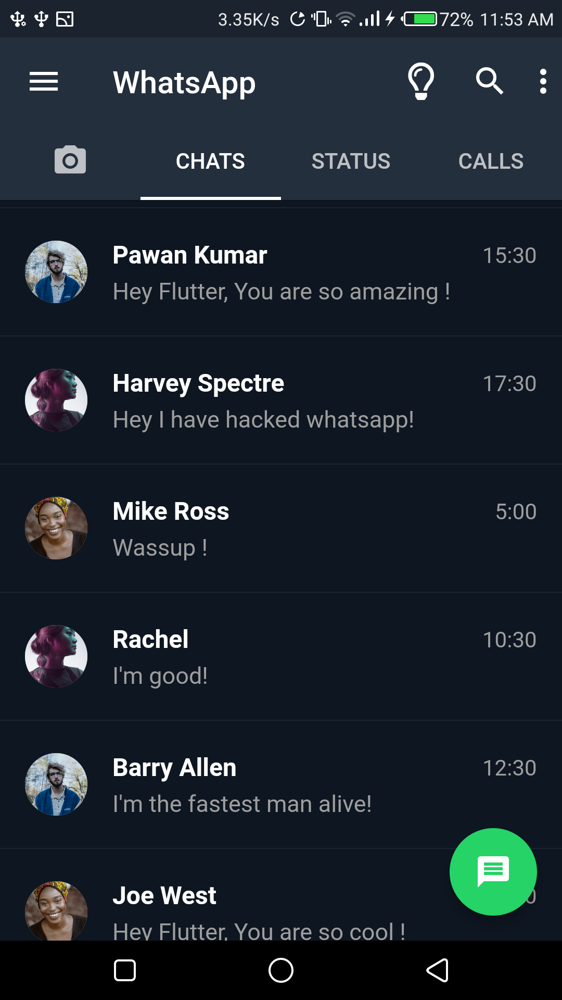 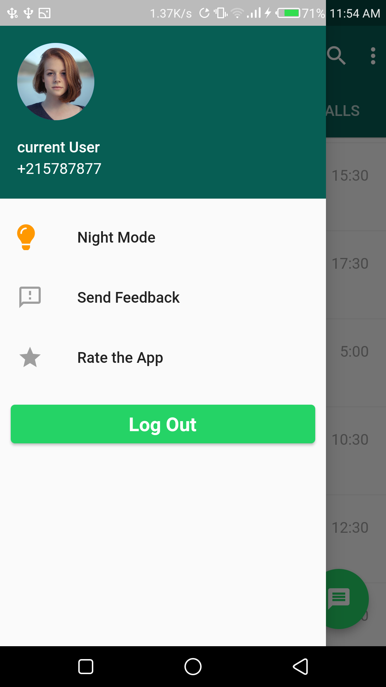
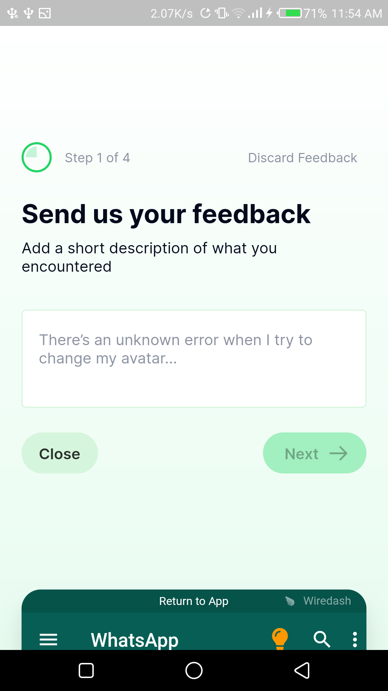 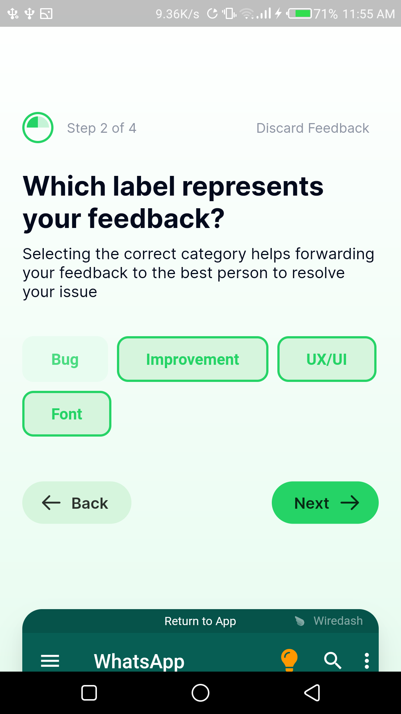
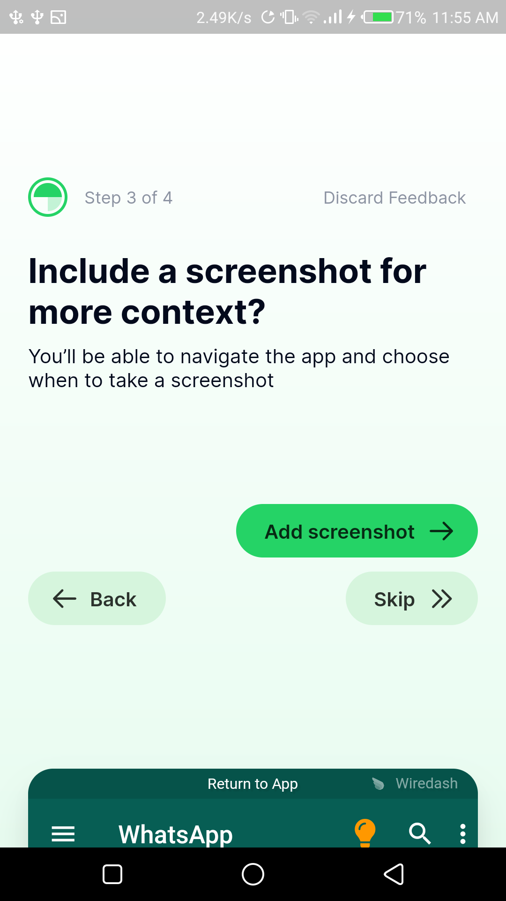 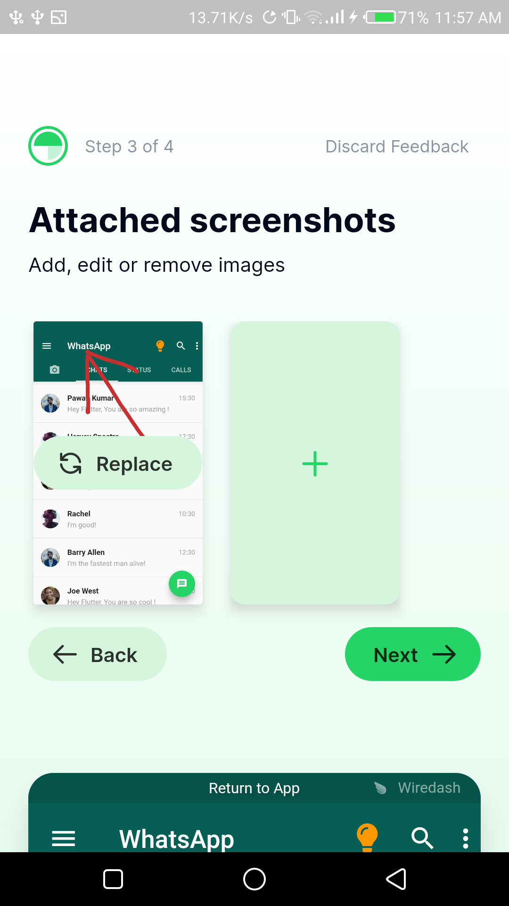
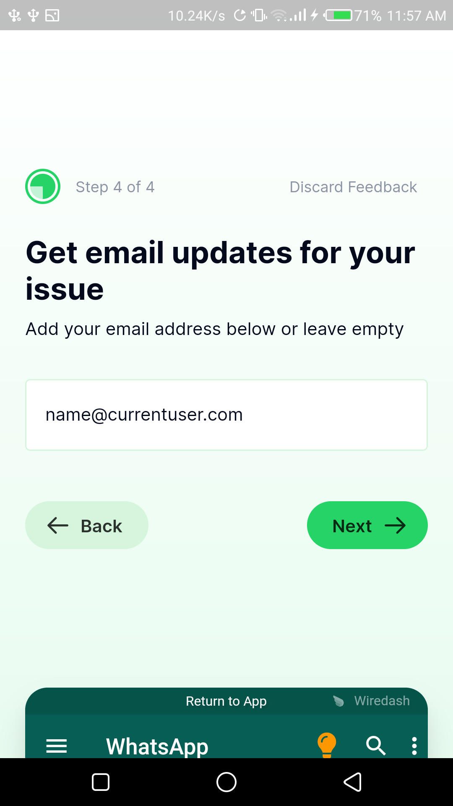 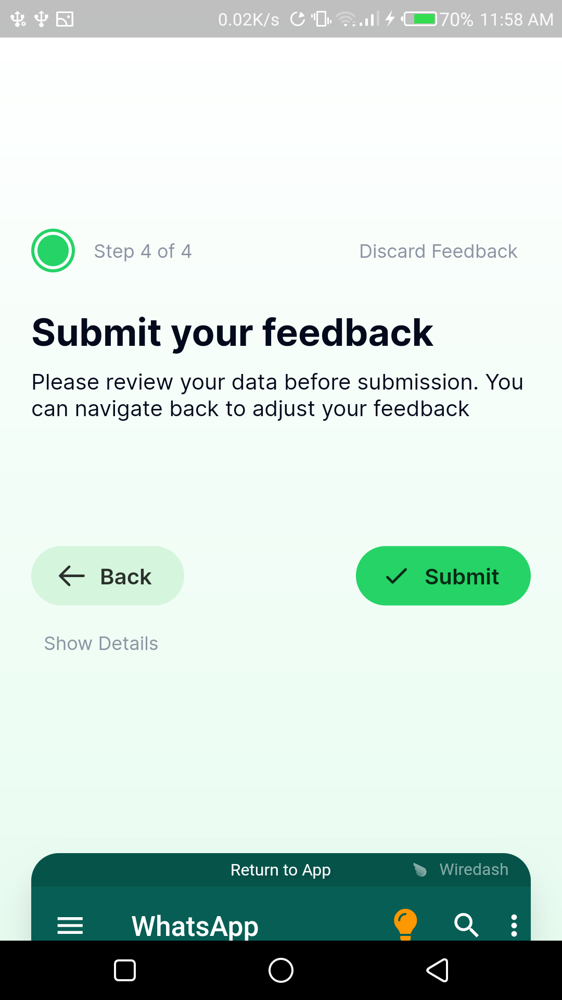
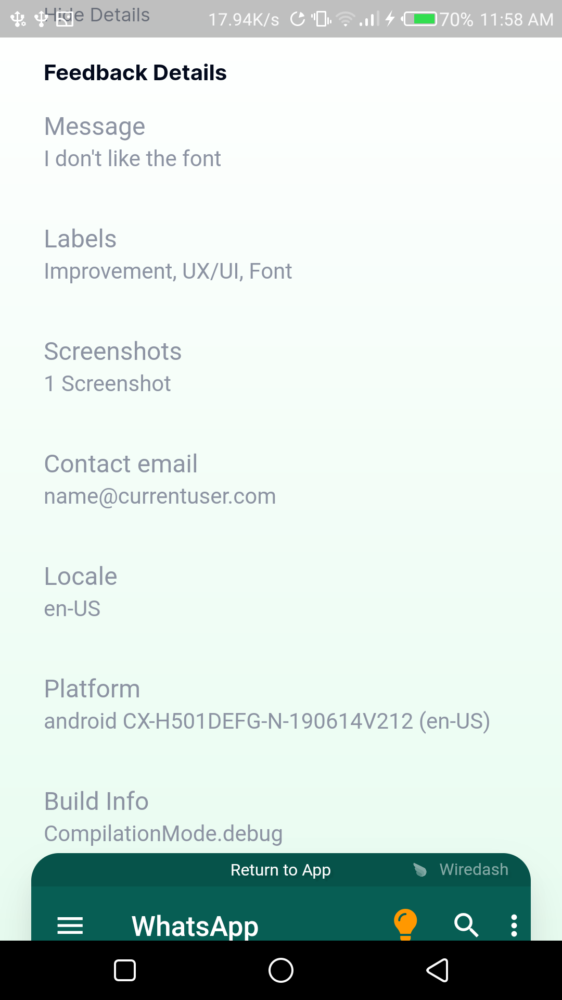 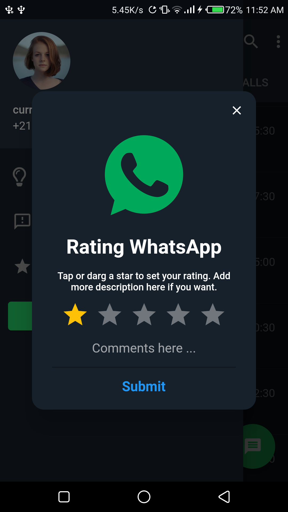

